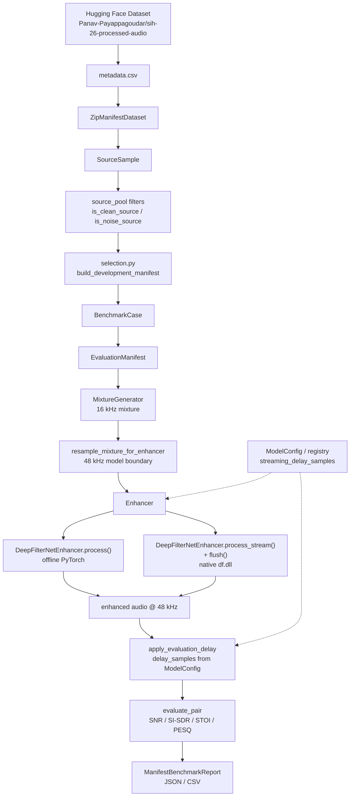

# DRDO-ANC Project Status

**Primary source of truth for developers and AI/Cursor sessions.**

This document describes what is **actually implemented** in the repository as of the last verification date at the bottom. Items not confirmed in code are marked `UNKNOWN`, `PARTIAL`, or `PLANNED`.

---

## 1. Project Overview

**DRDO-ANC** is an AI/ML-enabled adaptive noise cancellation / speech enhancement project for defence communication. The current repository infrastructure supports:

1. Loading a large Hugging Face audio corpus lazily from ZIP-backed manifests
2. Building **deterministic, reproducible benchmark cases** (clean + noise + SNR)
3. Running **DeepFilterNet3 (DF3)** in offline and native streaming modes
4. **Live microphone → enhancer → speaker** streaming via a synchronous I/O pipeline
5. Evaluating enhancement with shared objective metrics and streaming delay compensation

The codebase is intentionally layered:

```text
Dataset / Data Infrastructure
        ↓
Benchmark Infrastructure
        ↓
Enhancement Models
        ↓
Evaluation
```

| Layer | Responsibility |
|-------|----------------|
| **Dataset** | Discover source clips, read metadata, lazy ZIP access, represent `SourceSample` |
| **Benchmark** | Select cases, build manifests, generate mixtures, run benchmarks, store results |
| **Enhancement** | Model abstraction (`Enhancer`) and concrete implementations (currently DF3) |
| **Evaluation** | Delay alignment, SNR / SI-SDR / STOI / PESQ |

Training and fine-tuning are **out of scope** for the benchmark infrastructure; teammates may add new `Enhancer` implementations that plug into the same benchmark path.

---

## 2. Current Architecture



**Offline vs streaming divergence** happens inside `DeepFilterNetEnhancer` after the same 48 kHz noisy input is produced:

| Path | Enhancement API | Backend | Evaluation `delay_samples` |
|------|-----------------|---------|----------------------------|
| Offline | `process()` | PyTorch `df.enhance` | `0` |
| Streaming | `process_stream()` + `flush()` | `NativeDF3Backend` via `df.dll` | `1440` at 48 kHz (from `ModelConfig` for DeepFilterNet3) |

Both paths share the same upstream pipeline: manifest → mixture @ 16 kHz → resample → enhancer.

---

## 3. Repository File Map

### Audio (`src/drdo_anc/audio/`)

| File | Responsibility | Status | Important APIs / Notes |
|------|----------------|--------|------------------------|
| `io.py` | WAV load/save | DONE | `load_mono_wav`, `load_mono_wav_bytes`, `save_mono_wav` |
| `mixing.py` | Deterministic SNR mixing | DONE | `align_noise_to_clean_length`, `scale_noise_to_snr`, `create_mixture`, `calculate_snr` |
| `resampling.py` | Model-boundary resampling | DONE | `resample_mono` — uses `scipy.signal.resample_poly` |
| `live/interfaces.py` | Hardware-independent live I/O ABCs | DONE | `AudioInput`, `AudioOutput` |
| `live/fake.py` | In-memory I/O for tests | DONE | `FakeAudioInput`, `FakeAudioOutput` |
| `live/sounddevice_backend.py` | Desktop mic/speaker backend | DONE | `SoundDeviceAudioInput`, `SoundDeviceAudioOutput`, `list_audio_devices` — via `sounddevice`/PortAudio |
| `live/pipeline.py` | Live streaming orchestration | DONE | `StreamingPipeline` — arbitrary hardware chunks → `Enhancer.process_stream()` → output; single `flush()` on shutdown |
| `live/__init__.py` | Public live-audio exports | DONE | |
| `__init__.py` | Public audio exports | DONE | Re-exports io, mixing, resampling, live helpers |

### Dataset (`src/drdo_anc/dataset/`)

| File | Responsibility | Status | Important APIs / Notes |
|------|----------------|--------|------------------------|
| `manifest.py` | Metadata CSV parsing | DONE | `load_metadata_rows`, `METADATA_COLUMNS`, `SIH26_REPO_ID` |
| `source_sample.py` | Raw source clip metadata | DONE | `SourceSample` dataclass |
| `sample.py` | Benchmark-ready pair metadata | DONE | `AudioSample` (WAV-path based; used by `BenchmarkRunner`) |
| `protocol.py` | Dataset protocols | DONE | `Dataset`, `SourceDataset` ABCs |
| `list_dataset.py` | In-memory list dataset | DONE | `ListDataset` |
| `zip_access.py` | Lazy ZIP member reads | DONE | `ZipArchiveCache` |
| `zip_manifest_dataset.py` | HF ZIP manifest adapter | DONE | `ZipManifestDataset`, `load_audio`, `from_hf_hub` |
| `source_pool.py` | Clean/noise filtering & constants | DONE | `is_clean_source`, `is_noise_source`, `NOISE_CATEGORY_SOURCES`, development protocol constants |
| `__init__.py` | Public dataset exports | DONE | |

### Enhancement (`src/drdo_anc/enhancement/`)

| File | Responsibility | Status | Important APIs / Notes |
|------|----------------|--------|------------------------|
| `base.py` | Model abstraction | DONE | `Enhancer` ABC |
| `registry.py` | Model configuration registry | DONE | `ModelConfig`, `register_model`, `get_model_config`, `list_models`, `create_enhancer` — DeepFilterNet3 registered at import |
| `deepfilternet.py` | DF3 offline + streaming wrapper | DONE | `DeepFilterNetEnhancer` — loads PyTorch + native backends |
| `native.py` | ctypes wrapper for `df.dll` | DONE | `NativeDF3Backend` — `df_create`, `df_process_frame`, `df_free` |
| `streaming.py` | Chunk → frame adapter | DONE | `StreamingBuffer` |
| `__init__.py` | Public enhancement exports | DONE | `Enhancer`, `DeepFilterNetEnhancer`, registry helpers |

### Evaluation (`src/drdo_anc/evaluation/`)

| File | Responsibility | Status | Important APIs / Notes |
|------|----------------|--------|------------------------|
| `delay.py` | Evaluation alignment | DONE | `apply_evaluation_delay`, `format_delay_compensation` |
| `metrics.py` | Objective metrics | DONE | `calculate_snr`, `calculate_si_sdr`, `calculate_stoi`, `calculate_pesq`, `evaluate_pair`, `evaluate_model` |
| `__init__.py` | Public evaluation exports | DONE | |

### Benchmark (`src/drdo_anc/benchmark/`)

| File | Responsibility | Status | Important APIs / Notes |
|------|----------------|--------|------------------------|
| `case.py` | Reproducible case definition | DONE | `BenchmarkCase` |
| `evaluation_manifest.py` | Fixed evaluation manifest | DONE | `EvaluationManifest` — JSON save/load |
| `selection.py` | Deterministic case selection | DONE | `build_evaluation_manifest`, `build_development_manifest` |
| `mixture.py` | Mixture generation | DONE | `MixtureGenerator`, `MixtureResult` — in-memory cache |
| `config.py` | Benchmark configuration | DONE | `BenchmarkMode`, `BenchmarkConfig`, `STREAMING_CHUNK_SIZES` |
| `runner.py` | WAV-path benchmark runner | DONE | `BenchmarkRunner` — uses `AudioSample` + on-disk WAVs |
| `manifest_benchmark.py` | Manifest-driven enhancer benchmark | DONE | `ManifestBenchmarkRunner` (generic `Enhancer`), `ManifestCaseResult`, `ManifestBenchmarkReport` — takes `streaming_delay_samples` from model config |
| `result.py` | Runner result types | DONE | `SampleResult`, `BenchmarkResult` |
| `__init__.py` | Public benchmark exports | DONE | |

### Scripts (`scripts/`)

| File | Responsibility | Status | Important APIs / Notes |
|------|----------------|--------|------------------------|
| `run_df3_manifest_benchmark.py` | **Primary** 60-case manifest benchmark CLI | DONE | Smoke + full run, mandatory validation, JSON/CSV output; `--model` selects registered enhancer (default: DeepFilterNet3) |
| `test_df3_manifest_benchmark.py` | Manifest benchmark tests | DONE | Mock + registry + optional HF/DF3 integration (`SIH26_INTEGRATION=1`) |
| `test_evaluation_manifest.py` | Manifest + mixture tests | DONE | 14 tests including distribution, SNR accuracy, determinism |
| `test_zip_manifest_dataset.py` | Dataset adapter tests | DONE | Unit + optional `SIH26_INTEGRATION=1` |
| `test_benchmark_runner.py` | Generic runner tests | DONE | Mock + DF3 on local Freesound WAVs |
| `test_evaluate_delay.py` | Delay compensation regression | DONE | Pins historical Freesound alignment metrics |
| `test_streaming_backend.py` | Native backend smoke test | DONE | Frame processing, buffer, reset |
| `test_enhancer_streaming.py` | Enhancer streaming smoke | DONE | Arbitrary chunk sizes |
| `run_live_enhancement.py` | Live mic → enhancer → speaker CLI | DONE | `--model` (registry), `--passthrough`, `--list-devices`, `--chunk-size`, device selection |
| `test_live_audio.py` | Live audio pipeline tests | DONE | Fake I/O only — no physical microphone required |
| `build_evaluation_fixtures.py` | Local manifest fixtures | DONE | Builds `tests/fixtures/evaluation_manifest/` at test time |
| `evaluate.py` | Thin evaluation CLI | DONE | Wraps `drdo_anc.evaluation` |
| `investigate_streaming_alignment.py` | Alignment investigation (read-only) | DONE | Offset sweep; not part of CI |
| `run_streaming_benchmark.py` | Legacy single-file streaming demo | DONE | Pre-manifest experiment script |
| `mix_audio.py` | Manual mixing utility | DONE | Pre-manifest SNR mixing |
| `run_enhancement.py`, `run_deepfilternet.py`, `run_snr_enhancement.py` | Enhancement CLIs | DONE | Pre-benchmark workflows |
| `evaluate_snr_sweep.py`, `run_snr_sweep.py` | SNR sweep utilities | DONE | **Caution:** offline vs streaming delay mismatch if misconfigured |
| `test_df_native.py`, `test_df_native_frame.py`, `test_df_streaming_wav.py`, `test_df_latency.py` | DF3 development tests | DONE | Lower-level DF3 validation |
| `analyze_streaming_alignment.py` | Alignment analysis helper | DONE | Investigation utility |

### Tests / fixtures

| Path | Responsibility | Status | Notes |
|------|----------------|--------|-------|
| `tests/fixtures/zip_manifest/` | ZipManifestDataset fixtures | DONE | Generated by `test_zip_manifest_dataset.py` if missing |
| `tests/fixtures/evaluation_manifest/` | Manifest/mixture fixtures | DONE | Generated by `build_evaluation_fixtures.py` |
| `tests/` (top-level pytest suite) | — | **NOT DONE** | No committed pytest suite; tests live under `scripts/test_*.py` |

### Benchmark results (`data/benchmark_results/`)

| File | Responsibility | Status | Notes |
|------|----------------|--------|-------|
| `df3_manifest_benchmark_smoke.json` | 2-case smoke results | DONE | 4 rows (2 cases × 2 modes), 0 failures |
| `df3_manifest_benchmark_full.json` | 60-case full results | DONE | 120 rows (60 cases × 2 modes), 0 failures |
| `df3_manifest_benchmark_*.csv` | Tabular exports | PARTIAL | May exist locally; `*.csv` is gitignored |

### External / vendor

| Path | Responsibility | Status | Notes |
|------|----------------|--------|-------|
| `external/DeepFilterNet/` | Upstream DF3 source + build artifacts | DONE (local) | Gitignored; requires local build of `df.dll` |
| `external/DeepFilterNet/target/release/df.dll` | Native streaming library | DONE (local) | Required for streaming; path configured in `deepfilternet.py` |
| `external/DeepFilterNet/models/DeepFilterNet3_onnx.tar.gz` | Native model bundle | DONE (local) | Used by `NativeDF3Backend` |

---

## 4. Enhancement Architecture

### `Enhancer` abstraction

Defined in `src/drdo_anc/enhancement/base.py`:

```text
Enhancer (ABC)
   └── DeepFilterNetEnhancer

ModelConfig / registry
   └── DeepFilterNet3 (streaming_delay_samples=1440)
```

### Model registry

Implemented in `src/drdo_anc/enhancement/registry.py`:

| API | Purpose |
|-----|---------|
| `ModelConfig` | Frozen dataclass: `name`, `streaming_delay_samples`, `factory` |
| `register_model()` | Register a new enhancer configuration by name |
| `get_model_config()` | Look up configuration for CLI / benchmark wiring |
| `list_models()` | Return sorted registered model names |
| `create_enhancer()` | Instantiate (and optionally `load()`) a registered enhancer |

**Registered models (built-in):**

| Name | Factory | `streaming_delay_samples` |
|------|---------|---------------------------|
| `DeepFilterNet3` | `DeepFilterNetEnhancer` | `1440` |

Teammate fine-tuned models register via `register_model(ModelConfig(...))` before benchmark execution. Each model supplies its own streaming delay; offline delay remains `0` for all models.

| Method | Purpose | Infrastructure vs model-specific |
|--------|---------|-----------------------------------|
| `load()` | Load model weights and processing state | Model-specific |
| `process(audio)` | Enhance a complete utterance | Model-specific backend choice |
| `process_stream(audio_chunk)` | Enhance an arbitrary chunk | Model-specific; infrastructure provides chunk cycling in runners |
| `flush()` | Emit remaining buffered output | Model-specific |
| `reset()` | Reset streaming/native state | Model-specific |
| `sample_rate()` | Expected input sample rate | Model-specific |
| `name()` | Human-readable model name | Model-specific |

**Infrastructure-level** concerns (outside `Enhancer`):

- Manifest-driven mixture generation
- 16 kHz → 48 kHz resampling at model boundary
- Chunk size sequences in benchmark runners
- Evaluation delay compensation
- Metric calculation

**Future fine-tuned models** should implement the same `Enhancer` interface so `BenchmarkRunner` / `ManifestBenchmarkRunner` can compare models fairly on identical noisy inputs.

---

## 5. DeepFilterNet3 Implementation

### Offline path

```text
PyTorch checkpoint (via df.init_df)
    ↓
DeepFilterNetEnhancer.process()
    ↓
df.enhance(model, df_state, audio)
```

- Loaded from DeepFilterNet Python package (`from df import enhance, init_df`)
- Checkpoint cached under user home (e.g. `DeepFilterNet/Cache/DeepFilterNet3`)
- Expects **48 kHz** floating-point mono tensor `[1, T]`

### Streaming path

```text
Python (DeepFilterNetEnhancer.process_stream)
    ↓
StreamingBuffer (arbitrary chunk → 480-sample frames)
    ↓
NativeDF3Backend.process_frame (ctypes)
    ↓
external/DeepFilterNet/target/release/df.dll
    ↓
df_create / df_process_frame / df_free
    ↓
persistent native DF3 state
```

| Item | Value / location |
|------|------------------|
| DLL path (repo-relative) | `external/DeepFilterNet/target/release/df.dll` |
| Model path (repo-relative) | `external/DeepFilterNet/models/DeepFilterNet3_onnx.tar.gz` |
| Model format | ONNX bundle inside `.tar.gz` (native tract backend) |
| Frame size | **480 samples** (`NativeDF3Backend.frame_length()` after load) |
| Frame duration @ 48 kHz | **10 ms** (480 / 48000) |
| Native API functions | `df_create`, `df_get_frame_length`, `df_process_frame`, `df_free` |
| Attenuation limit default | `100.0` dB (`NativeDF3Backend`) |

### State lifecycle

1. `DeepFilterNetEnhancer.load()` creates offline PyTorch model **and** native backend + `StreamingBuffer`
2. `process_stream()` appends chunks to `StreamingBuffer`, processes complete 480-sample frames
3. `flush()` zero-pads the final partial frame, processes one frame, returns only samples corresponding to real input
4. `reset()` calls `NativeDF3Backend.reset()` (destroys and recreates native state) and clears `StreamingBuffer`

### Output-length guarantee (streaming)

After `process_stream` over the full input **plus** `flush()`, benchmark runners require `len(enhanced) == len(noisy)`. Enforced in `BenchmarkRunner._enhance_streaming` and `ManifestBenchmarkRunner._enhance_streaming`.

> **Note:** `deepfilternet.py` contains unreachable duplicate code after the first `flush()` implementation (lines following the first `return`). The active implementation is the first block. Cleanup is `PLANNED` but not required for correctness.

---

## 6. Streaming Architecture

### Incoming chunk vs DF3 frame

| Concept | Size | Where |
|---------|------|-------|
| **Incoming chunk** | Arbitrary (e.g. 300, 700, 250, …) | Benchmark runner feeds `process_stream` |
| **DF3 processing frame** | Fixed 480 samples | `StreamingBuffer.frame_length` |

`StreamingBuffer` (`src/drdo_anc/enhancement/streaming.py`):

1. **`append(audio)`** — concatenate to internal buffer, emit zero or more complete 480-sample frames
2. **`pending_samples()`** — count of samples not yet forming a full frame
3. **`flush()`** — return and clear remaining partial buffer (used internally; final padding happens in `DeepFilterNetEnhancer.flush()`)
4. **`clear()`** — reset buffer without emitting

### Example

```text
Append 300 samples → 0 frames emitted, 300 pending
Append 700 samples → buffer 1000 → 2 frames (960 samples) emitted, 40 pending
```

At end of utterance, `DeepFilterNetEnhancer.flush()` pads the 40 pending samples to 480, processes one native frame, returns 40 enhanced samples.

Benchmark runners cycle through `STREAMING_CHUNK_SIZES` in `src/drdo_anc/benchmark/config.py`:

```python
(300, 700, 250, 1000, 137, 911, 2048, 512, 1536, 800, 1200)
```

---

## 7. The 1440-Sample / 30 ms Delay

### Definition

```text
1440 samples ÷ 48000 Hz = 0.030 s = 30 ms
```

This is an **algorithmic alignment offset** of the native streaming DF3 output relative to the clean/noisy timeline at the **model sample rate (48 kHz)**.

### Evaluation policy

| Mode | `delay_samples` | Where set |
|------|-----------------|-----------|
| Offline | `0` | `ManifestBenchmarkRunner` / `BenchmarkConfig` |
| Streaming | Model-specific (e.g. `1440` for DeepFilterNet3) | `ModelConfig.streaming_delay_samples` → passed to `ManifestBenchmarkRunner` as `streaming_delay_samples`; `delay_samples_for_mode()` applies it per mode |

Compensation is applied in **`evaluation.delay.apply_evaluation_delay`**, not inside the streaming model. The first `delay_samples` enhanced samples are dropped; clean and noisy are truncated to the same overlap length.

### Why offset-0 streaming evaluation fails

Evaluating streaming enhanced output against the clean reference **without** delay compensation aligns the wrong samples. On the historical **Freesound SNR-0 experiment** (local WAVs under `data/`), regression tests in `scripts/test_evaluate_delay.py` pin:

| Condition | Enhanced SI-SDR | Enhanced STOI |
|-----------|-----------------|---------------|
| Streaming, `delay_samples=0` | **≈ −42.1 dB** | **≈ 0.504** |
| Streaming, `delay_samples=1440` | **≈ +9.6 dB** | **≈ 0.975** |

`scripts/investigate_streaming_alignment.py` performs a broader offset sweep and reported best alignment near **offset −1440 samples** with high correlation (~0.95). Those sweep details are investigation output, not pinned in automated tests except via the `delay_samples=1440` metrics above.

### Distinction from current manifest benchmark

The **DeepFilterNet3 development benchmark** (SIH-26 manifest, 60 cases) produces different absolute metric values because mixtures, speakers, and noise categories differ from the Freesound experiment. Example from `data/benchmark_results/df3_manifest_benchmark_full.json` case 00001 @ 0 dB:

- Offline SI-SDR ≈ **11.88 dB**
- Streaming SI-SDR ≈ **9.70 dB** (with `delay_samples=1440`)

The delay rule is the same; only the underlying audio changed.

---

## 8. Sample Rate Architecture

| Stage | Sample rate |
|-------|-------------|
| HF source WAVs | **16 kHz** (native in dataset) |
| `MixtureGenerator` output | **16 kHz** |
| DF3 model input | **48 kHz** |
| Evaluation (manifest benchmark) | **48 kHz** (after `resample_mixture_for_enhancer`) |

### Rules

```text
Dataset layer:           native source rate (no resampling)
Mixture generation:      native source rate
Model boundary:          resample to model-required rate
Evaluation:              same rate as model output / resampled reference
```

**Resampling location:** `src/drdo_anc/benchmark/manifest_benchmark.py` → `resample_mixture_for_enhancer()` → `src/drdo_anc/audio/resampling.py` → `resample_mono()`.

`ZipManifestDataset.load_audio()` must **not** resample. PESQ inside `evaluation/metrics.py` may resample to 16 kHz internally for wideband PESQ only.

---

## 8A. Live Audio I/O

Synchronous live-audio path for real-time enhancement (no dataset/manifest/evaluation layers involved).

```text
SoundDeviceAudioInput.read(chunk_size)
    ↓ arbitrary hardware chunk (float32 mono)
StreamingPipeline
    ↓ torch tensor
Enhancer.process_stream()          [or pass-through copy]
    ↓ inside enhancer: StreamingBuffer → model frames
SoundDeviceAudioOutput.write()
```

### Interfaces

| Component | Role |
|-----------|------|
| `AudioInput` | `read(max_samples)` → mono float32 chunk; empty array = end-of-stream |
| `AudioOutput` | `write(audio)` → host playback |
| `StreamingPipeline` | Read loop, optional enhancement, single `flush()` on shutdown |
| `FakeAudioInput` / `FakeAudioOutput` | Scripted in-memory I/O for CI |

### Sample rate

| Mode | Rate |
|------|------|
| DeepFilterNet3 enhancement | **48 kHz** (from `enhancer.sample_rate()`) |
| Pass-through (`--passthrough`) | **48 kHz** default; override with `--sample-rate` |

Input, output, and enhancer sample rates must match. Live I/O does **not** resample — resampling remains at the benchmark model boundary only.

### Chunk-size behavior

| Layer | Chunk size |
|-------|------------|
| `StreamingPipeline` | Requests `--chunk-size` samples per `read()` (default **1024**) |
| Host / `AudioInput` | May return fewer samples; sizes are arbitrary |
| `Enhancer.process_stream()` | Receives hardware chunks as-is |
| `StreamingBuffer` (inside enhancer) | Converts arbitrary chunks to **480-sample** DF3 frames |

Hardware chunk sizes are unrelated to model frame sizes.

### Device selection

- `scripts/run_live_enhancement.py --list-devices` prints PortAudio device indices.
- `--input-device` / `--output-device` accept an integer index or host-specific name.
- Omit both to use the host default input/output devices.

### Shutdown semantics

1. `StreamingPipeline.run()` calls `enhancer.reset()` once at stream start.
2. Loop ends on empty input, `request_stop()`, or `KeyboardInterrupt` (Ctrl+C).
3. `enhancer.flush()` is called **exactly once** in the shutdown path.
4. Any flush output is written to `AudioOutput`, then both I/O devices are closed.
5. Pass-through mode (`enhancer=None`) skips enhancement and flush.

### Entry point

```bash
.venv\Scripts\python.exe scripts\run_live_enhancement.py --model DeepFilterNet3
.venv\Scripts\python.exe scripts\run_live_enhancement.py --passthrough
```

**Dependency:** `sounddevice` (PortAudio) — listed in `pyproject.toml`.

**Not implemented yet:** asyncio, multiprocessing, GPU/TensorRT live optimization, live evaluation metrics.

---

## 9. Dataset Architecture

```text
metadata.csv
    ↓
ZipManifestDataset
    ↓
SourceSample
```

### Hugging Face dataset

- **Repo ID:** `Panav-Payappagoudar/sih-26-processed-audio` (`src/drdo_anc/dataset/manifest.py`)
- **Metadata file:** `metadata.csv`

### Metadata columns

`archive_name`, `internal_path`, `filename`, `parent_folder`, `file_size_bytes`, `audio_class`, `dataset_source`, `inferred_subclass`

### ZIP structure

Each `archive_name` refers to a `.zip` file on Hugging Face. `internal_path` is the path inside the archive to one WAV member. `ZipArchiveCache` reads members in memory without full extraction.

### Lazy access behavior

1. **Construction** — loads only `metadata.csv` rows into memory
2. **First `load_audio()` for an archive** — may call `huggingface_hub.hf_hub_download` for that ZIP only
3. **Subsequent reads** — reuse HF cache / `ZipArchiveCache`

### Constructor options

| Parameter | Purpose |
|-----------|---------|
| `metadata_path` | Local CSV path |
| `repo_id` | HF dataset repo for archive download |
| `archive_dir` | Use local ZIP directory instead of HF |
| `cache_dir` | Optional HF cache override |
| `indices` | Optional row subset |

### Approximate dataset scale

| Item | Status |
|------|--------|
| Total metadata rows | **UNKNOWN** in repo (not pinned; integration tests download live `metadata.csv`) |
| MS-SNSD mislabeled clean rows | Documented as **~24k** in `SourceSample` docstring |
| Full dataset download size | **UNKNOWN** in repo artifacts |
| Development benchmark archives touched | **4 ZIP categories + metadata** (see §19) |

---

## 10. Dataset Known Issues

| Issue | Status | Notes |
|-------|--------|-------|
| Source audio is 16 kHz | CONFIRMED | Native rate preserved in dataset layer |
| MS-SNSD clean files mislabeled as `noise` | CONFIRMED | Filtered via `is_ms_snsd_clean_row` / `is_noise_source` |
| No pre-built clean/noisy pairs | CONFIRMED | Mixtures generated by `MixtureGenerator` |
| No SNR metadata in corpus | CONFIRMED | SNR set per `BenchmarkCase` |
| No official benchmark split in HF dataset | CONFIRMED | Split defined by `EvaluationManifest` |
| DEMAND duplicate/channel concerns | PARTIAL | `environmental` category maps to DEMAND; **excluded** from development manifest (`test_no_demand_category_in_development_manifest`) |
| Large archive sizes / lazy download | CONFIRMED | English archive is multi-GB; only needed archives are fetched |

---

## 11. Source Pool Filtering

Implemented in `src/drdo_anc/dataset/source_pool.py`.

| Function | Policy |
|----------|--------|
| `is_clean_source()` | `audio_class == "clean_speech"` **OR** MS-SNSD `clean_train` / `clean_test` |
| `is_noise_source()` | `audio_class == "noise"`, excluding MS-SNSD clean mislabels and subclasses `Test_Triplets`, `Training_Files` |
| `is_ms_snsd_clean_row()` | MS-SNSD rows in `clean_train` / `clean_test` |

### Approved development noise categories

| Category key | `dataset_source` |
|--------------|------------------|
| `uav_drone` | `Drone-Noise-Audio-set` |
| `impulsive_firearms` | `firearms-audio-dataset-contains-58-guntypes` |
| `vehicle_engine` | `Vehicle-Engine-Wind-Electronic-Electrical-Noise` |

Additional category keys exist for future use (`environmental` → DEMAND, `general_noise` → MS-SNSD) but are **not** in the development manifest.

---

## 12. Deterministic Benchmark Cases

`BenchmarkCase` (`src/drdo_anc/benchmark/case.py`) defines one reproducible experiment **without storing audio**:

```text
SourceSample  = raw dataset source clip
BenchmarkCase = reproducible experiment definition
```

| Field | Purpose |
|-------|---------|
| `case_id` | Stable identifier (e.g. `benchmark_eval_sih26-eval-v1_00001`) |
| `clean_source` | `SourceSample` reference |
| `noise_source` | `SourceSample` reference |
| `noise_category` | Logical category key |
| `snr_db` | Target mixture SNR |
| `mixing_seed` | Derived from SHA-256 of `case_id` |
| `mixing_policy_version` | Default `duration-align-v1` |

---

## 13. Evaluation Manifest

`EvaluationManifest` (`src/drdo_anc/benchmark/evaluation_manifest.py`) is a fixed, serializable benchmark definition.

**Why it exists:** Separate **what to evaluate** (manifest) from **how to load audio** (dataset) and **how to enhance** (model). Enables metadata-only manifest generation without downloading ZIPs.

| Field | Purpose |
|-------|---------|
| `dataset_repo_id` | HF dataset |
| `dataset_revision` | Optional pin |
| `selection_seed` | Stored protocol seed (`42`) |
| `rules_version` | Protocol version (`sih26-eval-v1`) |
| `split_name` | `benchmark_evaluation` |
| `snr_levels_db` | e.g. `(0.0, 5.0)` |
| `noise_categories` | Category tuple |
| `cases` | `tuple[BenchmarkCase, ...]` |

**JSON:** `save_json()` / `load_json()` — references source IDs and archive paths, **no embedded WAV data**.

---

## 14. Mixture Generation

```text
clean + noise
      ↓
duration alignment (align_noise_to_clean_length)
      ↓
noise scaling (scale_noise_to_snr)
      ↓
target SNR
      ↓
noisy = clean + scaled_noise
```

| Behavior | Implementation |
|----------|----------------|
| Long noise | Deterministic crop; start offset from `mixing_seed` |
| Short noise | Cyclic repetition with phase from `mixing_seed` |
| SNR formula | `scripts/mix_audio.py` compatible power ratio |
| Clipping | **None** — raw sum `clean + scaled_noise` |
| Determinism | Same `case_id` + policy → same mixture |
| Caching | `MixtureGenerator` in-memory cache keyed by `(case_id, mixing_policy_version)` |

**Fairness rule:** For a given case, offline and streaming must use the **same** generated noisy waveform. `ManifestBenchmarkRunner` generates the mixture once per case, then runs both modes.

---

## 15. Current Development Evaluation Protocol

**Development benchmark only** — not the final production benchmark.

| Parameter | Value |
|-----------|-------|
| Clean speakers | 10 unique English (`English-with-various-accents`) |
| Noise categories | 3 (`uav_drone`, `impulsive_firearms`, `vehicle_engine`) |
| SNR levels | 0 dB, +5 dB |
| Cases | **60** (10 × 3 × 2) |
| Selection seed | `42` |
| Rules version | `sih26-eval-v1` |
| Split name | `benchmark_evaluation` |

Built by `build_development_manifest()` in `src/drdo_anc/benchmark/selection.py`.

Architecture supports larger manifests via `build_evaluation_manifest(...)` (e.g. 100 × 5 × 5 = 2500) — **PLANNED**, not generated by default.

---

## 16. Benchmark Runner

### Generic WAV-path runner

| Component | Role |
|-----------|------|
| `BenchmarkRunner` | Enhance + evaluate `AudioSample` items with on-disk WAV paths |
| `BenchmarkConfig` | Mode, delay, timing, optional enhanced output paths |
| `BenchmarkMode` | `OFFLINE` / `STREAMING` |
| `SampleResult` / `BenchmarkResult` | Per-sample and aggregate metrics |

**Timing (`BenchmarkRunner`):** When `measure_timing=True`, includes **model inference only** (between `perf_counter` around enhance path, including streaming `flush`). Excludes WAV loading and metric computation.

**Requires:** Input WAVs already at enhancer sample rate (48 kHz for DF3).

### Manifest-based runner (model-agnostic)

| Component | Role |
|-----------|------|
| `ManifestBenchmarkRunner` | Manifest → mixture → resample → any `Enhancer` → evaluate |
| `ManifestCaseResult` | Per-case JSON-serializable row |
| `ManifestBenchmarkReport` | Aggregates + `save_json` / `save_csv` |

**Constructor:** Requires a loaded `Enhancer` and `streaming_delay_samples` (from `ModelConfig` when using the registry). No DF3-specific logic inside the runner.

**Timing (`ManifestBenchmarkRunner`):** Documented in class docstring — **model inference only** (offline `process` or streaming `process_stream` + `flush`). Excludes ZIP I/O, mixture generation, resampling, manifest parsing.

| Phase | Included in `inference_s`? |
|-------|---------------------------|
| ZIP I/O | No |
| Mixture generation | No |
| Resampling to 48 kHz | No |
| Model inference | **Yes** |
| Streaming flush | **Yes** (inside timed block) |
| Metric computation | No |

**Entry point:** `scripts/run_df3_manifest_benchmark.py` (default model: `DeepFilterNet3`; use `--model` for other registered enhancers)

---

## 17. Evaluation Metrics

Implemented in `src/drdo_anc/evaluation/metrics.py`.

| Metric | Function | Notes |
|--------|----------|-------|
| SNR | `calculate_snr` | Clean vs (estimate − clean) noise power |
| SI-SDR | `calculate_si_sdr` | Scale-invariant SDR |
| STOI | `calculate_stoi` | Via `pystoi` |
| PESQ | `calculate_pesq` | Wideband; resamples to 16 kHz internally if needed |

**Delay compensation:** `apply_evaluation_delay` before `evaluate_pair`.

**Preferred usage:** `evaluate_pair` or `evaluate_model` from `drdo_anc.evaluation` — do not reimplement metrics in scripts.

`ManifestBenchmarkRunner` reports **enhanced** metrics (clean vs enhanced) via `evaluate_pair` on aligned segments.

---

## 18. Current Benchmark Results

> **Label:** DeepFilterNet3 development benchmark — **not** final model-comparison results.

Source: `data/benchmark_results/df3_manifest_benchmark_*.json`

### Smoke test (2 cases × 2 modes = 4 evaluations)

| Metric | Value |
|--------|-------|
| Successful | **4/4** |
| Mean SI-SDR | 11.80 dB |
| Mean STOI | 0.857 |
| Mean PESQ | 1.617 |
| Mean SNR | 10.91 dB |
| Median RTF | 6.33× |

### Full 60-case benchmark (60 cases × 2 modes = 120 evaluations)

| Metric | Value |
|--------|-------|
| Successful | **120/120** |
| Failed | **0** |

**Overall (both modes combined):**

| Metric | Value |
|--------|-------|
| Mean SI-SDR | 12.71 dB |
| Mean STOI | 0.667 |
| Mean PESQ | 1.851 |
| Mean SNR | 12.31 dB |
| Median RTF | 9.68× |

**By SNR:**

| SNR | Mean SI-SDR | Mean STOI | Mean PESQ |
|-----|------------|-----------|-----------|
| 0 dB | 11.94 dB | 0.654 | 1.774 |
| +5 dB | 13.48 dB | 0.680 | 1.927 |

**By noise category:**

| Category | Mean SI-SDR | Mean STOI | Mean PESQ |
|----------|-------------|-----------|-----------|
| `uav_drone` | 12.87 dB | 0.668 | 1.782 |
| `impulsive_firearms` | 12.45 dB | 0.645 | 1.732 |
| `vehicle_engine` | 12.81 dB | 0.688 | 2.038 |

**Offline vs streaming (derived from full JSON):**

| Mode | Mean SI-SDR | Median RTF |
|------|-------------|------------|
| Offline | 12.81 dB | 18.69× |
| Streaming | 12.61 dB | 9.36× |

---

## 19. Dataset Download / Storage Behavior

### Implemented behavior (from code)

- Constructing `ZipManifestDataset` downloads **metadata only** (unless local path provided)
- Each `load_audio()` may download **one** archive ZIP on first access
- No full-corpus download is triggered automatically

### Observed during Step 3D full benchmark run

The 60-case development benchmark required **four** noise/clean archive ZIPs plus `metadata.csv`. A prior run on the development machine reported approximately **6.95 GB** total touched across:

- `English-with-various-accents.zip` (~6.7 GB)
- `Drone-Noise-Audio-set.zip` (~19 MB)
- `firearms-audio-dataset-contains-58-guntypes.zip` (~20 MB)
- `Vehicle-Engine-Wind-Electronic-Electrical-Noise.zip` (~230 MB)

This figure is **observational** (not stored in benchmark JSON artifacts). The full Hugging Face dataset was **not** downloaded.

---

## 20. Test Coverage

Tests are **script-based** (`python scripts/test_*.py`), not a committed pytest suite. Status below verified with `.venv` on 2026-08-29 unless noted.

### Dataset tests

| Test | Purpose | Status |
|------|---------|--------|
| `test_zip_manifest_dataset.py` | Metadata parsing, lazy load, ZIP errors | PASS |
| `test_zip_manifest_dataset.py::test_integration_real_dataset_sample` | Live HF sample | PASS (when `SIH26_INTEGRATION=1`) |

### Mixture / manifest tests

| Test | Purpose | Status |
|------|---------|--------|
| `test_evaluation_manifest.py` (14 tests) | Filters, determinism, distribution, SNR accuracy, mixture determinism | PASS |
| `test_evaluation_manifest.py::test_integration_real_metadata_manifest` | Live metadata → 60-case manifest | PASS (when `SIH26_INTEGRATION=1`) |

### Streaming tests

| Test | Purpose | Status |
|------|---------|--------|
| `test_streaming_backend.py` | Native frame processing, buffer, reset | PASS |
| `test_enhancer_streaming.py` | Arbitrary chunk streaming via enhancer | PASS |

### Live audio tests

| Test | Purpose | Status |
|------|---------|--------|
| `test_live_audio.py` (6 tests) | Pass-through, arbitrary chunks, single flush, fake I/O only | PASS |

### Evaluation tests

| Test | Purpose | Status |
|------|---------|--------|
| `test_evaluate_delay.py` | Delay alignment shapes + pinned Freesound metrics | PASS |

### Benchmark tests

| Test | Purpose | Status |
|------|---------|--------|
| `test_benchmark_runner.py` | Mock runner + DF3 on local WAVs | PASS |
| `test_df3_manifest_benchmark.py` (8 unit tests) | Manifest validation, resampling, mock benchmark, serialization | PASS |

### DF3 integration tests

| Test | Purpose | Status |
|------|---------|--------|
| `test_df3_manifest_benchmark.py::test_df3_smoke_benchmark_integration` | 2-case live HF + DF3 | PASS (requires `SIH26_INTEGRATION=1` + DF3 build) |
| `test_benchmark_runner.py` DF3 tests | Local Freesound WAV integration | PASS |

---

## 21. Completed vs Pending

### DONE

- [x] Evaluation layer extraction (`drdo_anc.evaluation`)
- [x] Streaming delay compensation (`apply_evaluation_delay`)
- [x] `Enhancer` ABC + `DeepFilterNetEnhancer`
- [x] Native DF3 streaming via `df.dll` + `StreamingBuffer`
- [x] `ZipManifestDataset` lazy HF ZIP access
- [x] `SourceSample` / `AudioSample` separation
- [x] Source pool filtering (`source_pool.py`)
- [x] Deterministic `BenchmarkCase` + `EvaluationManifest`
- [x] `MixtureGenerator` with deterministic alignment and SNR
- [x] Model-boundary resampling (`resample_mono`)
- [x] `ManifestBenchmarkRunner` + `scripts/run_df3_manifest_benchmark.py`
- [x] Model registry / generic model configuration (`enhancement/registry.py`)
- [x] `ManifestBenchmarkRunner` decoupled from DF3 (`streaming_delay_samples` from `ModelConfig`)
- [x] 60-case development protocol (`sih26-eval-v1`)
- [x] Completed DF3 development benchmark JSON results
- [x] Generic `BenchmarkRunner` for WAV-path datasets (`ListDataset`, local files)
- [x] Live audio I/O layer (`AudioInput`/`AudioOutput`, sounddevice backend, `StreamingPipeline`)
- [x] Live enhancement CLI (`run_live_enhancement.py`) with pass-through mode

### PARTIAL

- [ ] `BenchmarkRunner` ↔ manifest pipeline integration (manifest runner is separate; no unified WAV-path bridge)
- [ ] `run_df3_manifest_benchmark.py` multi-model comparison in one invocation (single-model via `--model` works today)
- [ ] `AudioSample` bridge from `MixtureResult` (mixture stops at in-memory arrays)
- [ ] Production 2,500-case manifest (architecture supports via `build_evaluation_manifest`, not default)
- [ ] Committed pytest test suite under `tests/` (fixtures generated ad hoc)
- [ ] `README.md` (minimal stub only)
- [ ] Dead/unreachable duplicate code in `DeepFilterNetEnhancer.flush()`
- [ ] Benchmark CSV artifacts (gitignored; JSON present)

### NOT DONE

- [ ] `scripts/run_benchmark.py` unified multi-model benchmark CLI (single-model selection via `--model` exists on `run_df3_manifest_benchmark.py`)
- [ ] Multi-model fair comparison dashboard
- [ ] Production evaluation-set policy (100 speakers × 5 categories × 5 SNRs)
- [ ] Fine-tuned model `Enhancer` implementations (teammate responsibility)
- [ ] Training pipeline integration
- [ ] Persistent mixture WAV cache (by design omitted)

### BLOCKED

- [ ] None explicitly blocked in repository — external dependencies:
  - `external/DeepFilterNet` build (`df.dll`) required for streaming on each machine
  - Hugging Face access for live dataset tests and benchmarks

---

## 22. Current Next Steps

Recommended engineering tasks based on **actual** repository state:

1. **Integrate teammate fine-tuned models** — implement new `Enhancer` subclasses and register with `register_model(ModelConfig(...))`; run via `run_df3_manifest_benchmark.py --model <name>`.
2. **Multi-model comparison reporting** — aggregate `ManifestBenchmarkReport` JSON across models; optional comparison tables.
3. **Production manifest policy** — define and generate the 2,500-case manifest once protocol is approved; keep development manifest as default.
4. **Unified multi-model benchmark CLI** — optional `run_benchmark.py` to run several registered models in one command.
5. **Reporting dashboard** — visualize benchmark JSON across models (not started).

---

## 23. Protected / Stable Components

These components are working infrastructure. **Extend only for concrete requirements or bugs — do not recreate under new abstractions.**

| Component | Reason |
|-----------|--------|
| `ZipManifestDataset` | Lazy HF access, metadata-only construction |
| `SourceSample` | Stable source metadata representation |
| `BenchmarkCase` | Reproducible experiment unit |
| `EvaluationManifest` | Deterministic benchmark definition |
| `MixtureGenerator` | Fair noisy input generation |
| `Enhancer` interface | Model plug-in point |
| `ModelConfig` / `enhancement.registry` | Model instantiation and streaming delay wiring |
| `AudioInput` / `AudioOutput` / `StreamingPipeline` | Live I/O plug-in point |
| `NativeDF3Backend` + `StreamingBuffer` | Validated streaming path |
| `evaluation.metrics` + `evaluation.delay` | Shared metric and alignment logic |

> Future agents should extend these components only when a concrete requirement or bug requires it. Do not recreate existing functionality under a new abstraction.

---

## 24. Cursor / AI Development Rules

1. Read `PROJECT_STATUS.md` (repository root) before modifying architecture.
2. Inspect the actual repository before claiming something is missing.
3. Do not recreate existing abstractions.
4. Do not modify working DF3 streaming code without a demonstrated bug.
5. Do not move delay compensation into the model layer.
6. Do not put dataset resampling into `ZipManifestDataset`.
7. Do not download the entire Hugging Face dataset for development tasks.
8. Preserve deterministic benchmark behavior (manifest, mixing seeds, case IDs).
9. Use the same benchmark cases and noisy waveforms for all models.
10. Keep training/fine-tuning concerns separate from benchmark infrastructure.
11. **Always update `PROJECT_STATUS.md` after architectural changes** — it is the source of truth for developers and AI sessions.
12. Clearly distinguish DONE / PARTIAL / PLANNED / UNKNOWN.
13. Run relevant regression tests after architectural changes:
    - `scripts/test_evaluate_delay.py`
    - `scripts/test_evaluation_manifest.py`
    - `scripts/test_zip_manifest_dataset.py`
    - `scripts/test_benchmark_runner.py`
    - `scripts/test_df3_manifest_benchmark.py`
    - `scripts/test_streaming_backend.py`
    - `scripts/test_enhancer_streaming.py`
    - `scripts/test_live_audio.py`
14. Prefer small, targeted changes over broad rewrites.

**Environment:** Use project virtualenv `.venv\Scripts\python.exe` on Windows — system Python may lack `libdf` / DeepFilterNet dependencies.

---

## 25. File Ownership / Responsibility Rules

| Package / area | Owns |
|----------------|------|
| `src/drdo_anc/audio/` | WAV I/O, deterministic mixing, model-boundary resampling, live I/O (`audio/live/`) |
| `src/drdo_anc/dataset/` | Metadata parsing, ZIP access, `SourceSample`, source pool filters |
| `src/drdo_anc/enhancement/` | `Enhancer` ABC, model registry, and model implementations (DF3 offline + native streaming) |
| `src/drdo_anc/benchmark/` | Cases, manifests, selection, mixtures, runners, results |
| `src/drdo_anc/evaluation/` | Metrics, evaluation delay compensation |
| `scripts/` | Thin CLIs, integration tests, investigation utilities |
| `data/benchmark_results/` | Committed benchmark JSON outputs (CSVs may be local/gitignored) |
| `external/DeepFilterNet/` | Vendor DF3 source, DLL build, ONNX model bundle (gitignored) |

---

## 26. Historical Investigations

These investigations explain **why** the architecture exists:

| Investigation | Outcome |
|---------------|---------|
| Native DF3 ABI | `df_create`, `df_process_frame`, `df_free` in `libDF/src/capi.rs`; wrapped by `NativeDF3Backend` |
| Frame length discovery | Native frame = **480 samples** @ 48 kHz |
| Streaming state | Persistent native state; `reset()` destroys and recreates |
| Output buffering / flush | `StreamingBuffer` + zero-pad flush in `DeepFilterNetEnhancer.flush()` |
| Latency / alignment sweep | `investigate_streaming_alignment.py` — misalignment causes catastrophic metrics |
| **1440-sample alignment** | ~30 ms at 48 kHz; `delay_samples=1440` restores valid SI-SDR/STOI on Freesound test |
| Offline vs streaming comparison | Same enhancer family, different backends; streaming needs evaluation delay |
| Dataset packaging (Step 3B) | No native pairs/SNR/splits in HF metadata; filters and manifest protocol defined |
| SNR sweep misconfiguration | Applying streaming delay to **offline** enhanced WAVs produces invalid metrics |

---

## 27. Change Log

### Step 1 — Evaluation abstraction

| | |
|-|-|
| **Objective** | Extract reusable metrics and delay compensation from scripts |
| **Key implementation** | `src/drdo_anc/evaluation/` (`metrics.py`, `delay.py`); thin `scripts/evaluate.py` |
| **Status** | DONE |
| **Validation** | `test_evaluate_delay.py` pins Freesound streaming alignment metrics |

### Step 2 — Dataset/benchmark foundations

| | |
|-|-|
| **Objective** | Separate dataset samples, benchmark config, and generic WAV-path runner |
| **Key implementation** | `AudioSample`, `BenchmarkRunner`, `BenchmarkConfig`, `ListDataset` |
| **Status** | DONE |
| **Validation** | `test_benchmark_runner.py` (mock + DF3 on local WAVs) |

### Step 3A — ZIP manifest dataset

| | |
|-|-|
| **Objective** | Lazy Hugging Face ZIP manifest adapter |
| **Key implementation** | `ZipManifestDataset`, `ZipArchiveCache`, `SourceSample` |
| **Status** | DONE |
| **Validation** | `test_zip_manifest_dataset.py` |

### Step 3B — Evaluation protocol investigation

| | |
|-|-|
| **Objective** | Define clean/noise pools and development benchmark protocol |
| **Key implementation** | Investigation only; rules codified in `source_pool.py` + `selection.py` |
| **Status** | DONE |
| **Validation** | Approved protocol: 10 × 3 × 2 = 60 cases |

### Step 3C — Deterministic mixture layer

| | |
|-|-|
| **Objective** | Manifest → deterministic mixture without storing WAVs |
| **Key implementation** | `BenchmarkCase`, `EvaluationManifest`, `MixtureGenerator`, `audio/mixing.py` |
| **Status** | DONE |
| **Validation** | `test_evaluation_manifest.py` (14 tests) |

### Step 3D — End-to-end DF3 benchmark

| | |
|-|-|
| **Objective** | Run full development manifest through DF3 offline + streaming |
| **Key implementation** | `manifest_benchmark.py`, `audio/resampling.py`, `run_df3_manifest_benchmark.py` |
| **Status** | DONE |
| **Validation** | 120/120 successful; `df3_manifest_benchmark_full.json`; `test_df3_manifest_benchmark.py` |

### Step 3E — Model registry and generic manifest benchmark

| | |
|-|-|
| **Objective** | Decouple manifest benchmark from DF3; enable registered enhancers on the same `EvaluationManifest` |
| **Key implementation** | `enhancement/registry.py` (`ModelConfig`, `create_enhancer`); `ManifestBenchmarkRunner` takes `streaming_delay_samples`; `run_df3_manifest_benchmark.py --model` |
| **Status** | DONE |
| **Validation** | Full regression suite pass (2026-08-29); `test_model_registry_lists_deepfilternet3` in `test_df3_manifest_benchmark.py` |

### Step 4 — Live audio I/O

| | |
|-|-|
| **Objective** | Microphone → enhancer → speaker streaming with hardware-independent interfaces |
| **Key implementation** | `audio/live/` (`AudioInput`, `AudioOutput`, `StreamingPipeline`, sounddevice backend, fake I/O); `scripts/run_live_enhancement.py` |
| **Status** | DONE |
| **Validation** | `test_live_audio.py` (6 tests, fake I/O only); full regression suite pass (2026-08-29) |

---

## LAST VERIFIED

**2026-08-29**

## CURRENT PROJECT STATE

The repository provides a complete **deterministic benchmark pipeline** from Hugging Face ZIP manifests through mixture generation, model-boundary resampling, enhancement via any registered `Enhancer` (DeepFilterNet3 today), delay-aware evaluation, and JSON benchmark reports. The approved **60-case development manifest** (`sih26-eval-v1`) has been executed end-to-end with **zero failures** for DeepFilterNet3. A **minimal model registry** wires enhancer factories and per-model streaming delay into `ManifestBenchmarkRunner`. A **live audio I/O layer** (`StreamingPipeline` + sounddevice backend) supports real-time microphone → enhancer → speaker streaming with pass-through mode for hardware latency testing.

## NEXT RECOMMENDED ACTION

**Validate live streaming on target hardware** — run `run_live_enhancement.py --passthrough` to measure I/O latency, then `--model DeepFilterNet3` for end-to-end live enhancement. Integrate teammate fine-tuned models via the registry when ready.
