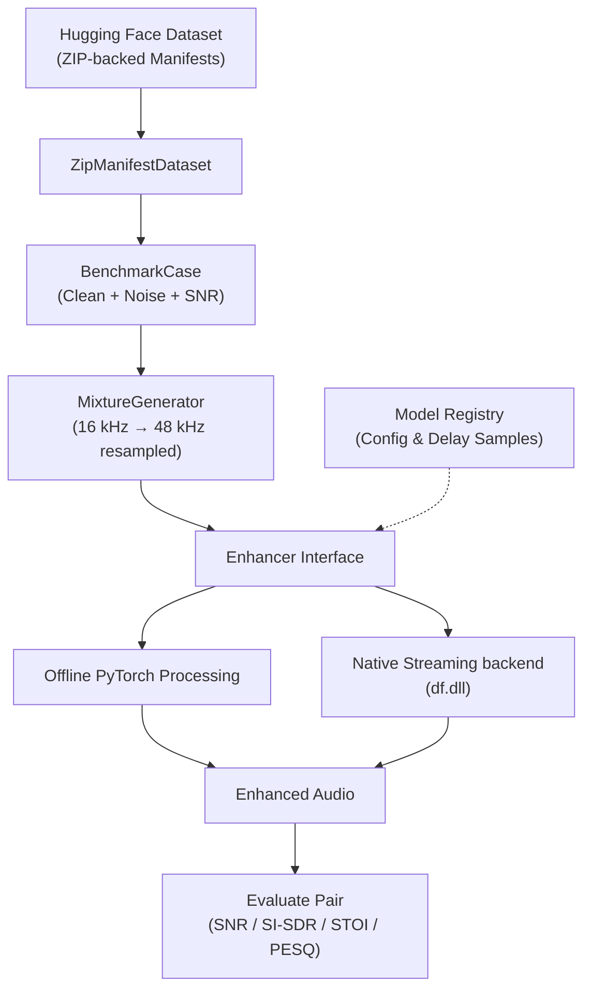

<div align="center">

# 🎧 DRDO-ANC

**An End-to-End Real-Time Active Noise Cancellation & Benchmarking Framework**

[](https://www.python.org/downloads/)
[](https://doc.qt.io/qtforpython-6/)
[](https://pytorch.org/)
[](https://opensource.org/licenses/MIT)

DRDO-ANC is an advanced AI/ML-enabled adaptive noise cancellation and speech enhancement project designed for deterministic offline benchmarking, DSP evaluation, and ultra-low-latency real-time hardware execution.

[Architecture](#-system-architecture) • [Core Layers](#-framework-layers) • [Models Integrated](#-models--dsp) • [Real-Time GUI](#-real-time-telemetry-gui) • [Installation](#-installation) • [Usage](#-usage)

</div>

---

## 🏗 System Architecture

DRDO-ANC provides a completely reproducible evaluation pipeline, bridging Hugging Face audio datasets to real-time hardware execution with seamless streaming-delay compensation.



---

## 🧠 Framework Layers

The codebase is strictly layered, isolating dataset management from model inference and DSP primitives.

| Layer | Responsibility | Key Features |
|-------|----------------|--------------|
| **Dataset** | Audio Corpus Management | Lazy ZIP access (`ZipManifestDataset`), reading source clip metadata. |
| **Benchmark** | Reproducible Evaluation | Generates deterministic mixtures, orchestrates runs, computes objective metrics, and saves JSON/CSV reports. |
| **Enhancement** | Model Abstraction | Defines the `Enhancer` interface. Seamlessly supports both offline enhancement and native streaming. |
| **DSP** | Signal Processing Core | Model-independent adaptive residual filtering (`NLMSFilter`). |
| **Live Audio I/O** | Hardware Integration | Synchronous duplex streams (`sounddevice`), dual-microphone capture, session recording, and offline session replay. |
| **Real-Time GUI** | Telemetry Visualization | Completely decoupled PySide6/QML frontend ensuring zero audio thread blocking. |

---

## 🚀 Models & DSP

The framework is built to evaluate and run models fairly by isolating their architecture-specific delays.

### DeepFilterNet3 (Primary Enhancer)
Integrated directly via the model registry, running in two modes:
1. **Offline Mode**: Utilizes PyTorch checkpoints (`df.enhance`) for bulk benchmarking with zero delay padding.
2. **Streaming Mode**: Utilizes the native Rust `df.dll` backend, chunking arbitrary audio inputs into complete frames via a custom `StreamingBuffer`. Inherently compensates for a strict **1440-sample** evaluation delay (at 48kHz).

### Adaptive DSP Filtering (NLMS)
A highly optimized, pure NumPy implementation of the Normalized Least Mean Squares (NLMS) adaptive residual-noise filter. Designed to act as a post-processing step to the AI speech enhancer, taking primary and reference channels to attenuate correlated hardware noise.

---

## 📊 Real-Time Telemetry GUI

The live telemetry interface is engineered for absolute performance. **The GUI may drop a visual frame, but the audio pipeline never waits for the GUI.**


### Technical Highlights
- **Decoupled Architecture**: `StreamingPipeline` executes in a daemon thread, executing non-blocking `telemetry_callbacks`.
- **GPU-Accelerated Oscilloscopes**: PySide6 QML `Canvas` draws glowing waveforms from highly downsampled, peak-preserved data arrays.
- **Dynamic LED Audio Meters**: Multi-stop gradients tracking Peak and RMS audio levels against hardware clipping limits.
- **Hardware Sparklines**: DevOps-style history graphing for **Real-Time Factor (RTF)**, **Processing Latency (ms)**, and **Buffer Overflows**.

---

## ⚙️ Installation

1. **Clone the repository:**
   ```bash
   git clone https://github.com/SIH-2026-27/DRDO-ANC.git
   cd DRDO-ANC
   ```

2. **Install Core Dependencies:**
   Install the framework locally, ensuring scientific computation and hardware audio drivers are present.
   ```bash
   pip install -e .
   pip install PySide6 sounddevice soundfile numpy torch scipy
   ```

3. **Install Machine Learning Backends:**
   ```bash
   pip install deepfilternet
   ```

---

## 💻 Usage

### 1. Real-Time Hardware UI

To monitor the active noise cancellation happening on your live hardware microphones (supports stereo/dual-microphone interfaces):

```bash
# Production Mode: AI Enhancement via DeepFilterNet3
python scripts/run_live_gui.py --model DeepFilterNet3

# Hardware Diagnostic Mode: Raw Microphone Pass-through
python scripts/run_live_gui.py --passthrough
```

### 2. Offline Benchmarking

To benchmark registered models against standard datasets:

```bash
# Run the primary 60-case manifest benchmark CLI
python scripts/run_df3_manifest_benchmark.py --model DeepFilterNet3
```

### 3. Dual-Microphone Experiments

To capture and analyze independent dual-microphone routing (primary/reference):
```bash
python scripts/test_dual_microphone.py --capture
```

---

## 📁 Repository Structure

```text
DRDO-ANC/
├── scripts/
│   ├── run_live_gui.py                # Main entry point for Real-Time UI
│   ├── run_df3_manifest_benchmark.py  # Benchmark orchestration
│   ├── analyze_live_session.py        # Offline energy-drop analysis
│   └── test_*.py                      # Hardware diagnostic tools
├── src/drdo_anc/
│   ├── audio/live/                    # sounddevice backends, recorders, duplex IO
│   ├── benchmark/                     # Manifest parsers, mixture generators, metrics
│   ├── dataset/                       # Lazy ZIP loaders, HF Integrations
│   ├── dsp/                           # Adaptive filters (NLMS)
│   ├── enhancement/                   # Model Registry, DF3 bindings, streaming buffers
│   └── gui/                           # PySide6 app, Thread-Safe Bridge, Telemetry properties
├── PROJECT_STATUS.md                  # Comprehensive architectural roadmap
├── implementation_plan.md             # Developer runbook and UI design specs
└── implementation_report.md           # Analysis of decoupled multi-threaded constraints
```

---
<div align="center">
<i>Built for real-time excellence. Designed to never miss a frame.</i>
</div>